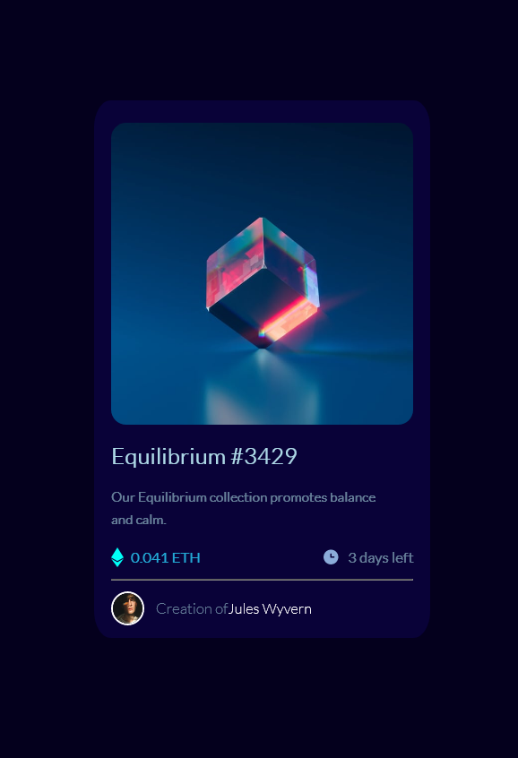

# Frontend Mentor - NFT preview card component solution

This is a solution to the [NFT preview card component challenge on Frontend Mentor](https://www.frontendmentor.io/challenges/nft-preview-card-component-SbdUL_w0U). Frontend Mentor challenges help you improve your coding skills by building realistic projects. 

## Table of contents

  - [The challenge](#the-challenge)
  - [Screenshot](#screenshot)
  - [Links](#links)
  - [Built with](#built-with)
  - [What I learned](#what-i-learned)
  - [Continued development](#continued-development)

- [Author](#author)
- [Acknowledgments](#acknowledgments)

### The challenge

Users should be able to:

- View the optimal layout depending on their device's screen size
- See hover states for interactive elements

### Screenshot

### Links

- Solution URL:(https://github.com/Nebil-Nej/NFT-preview)

### Built with

- Semantic HTML5 markup
- CSS custom properties
- Flexbox

### What I learned

what i learned is how to activate the action states, the hover keyterm in CSS and the use of border radius mostof all, as i forgot them at a time and was reminded by other ways.

### Continued development

i want to focus more on CSS and know some of the HTML tags more so they can come to me easily and i can use them easily.

## Author

- Frontend Mentor - [@Nebil-Nej](https://www.frontendmentor.io/profile/Nebil-Nej)

## Acknowledgments

I would like to thank "tsbdesign" for posting a video on youtube that helped me in making this. 

